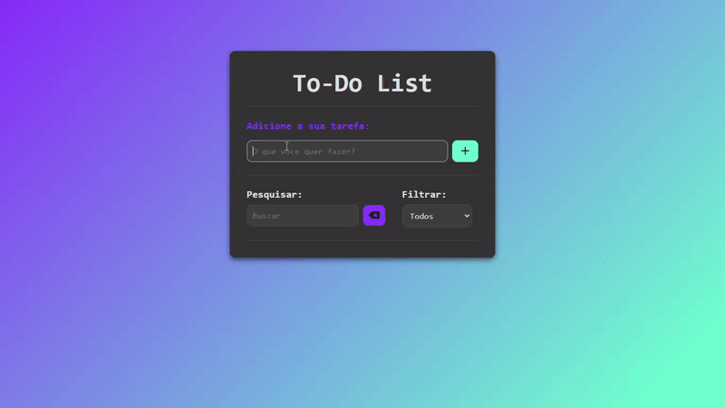

# 📋 To-Do List

Este é um projeto simples de To-do List feito em JavaScript, HTML e CSS. Ele permite que os usuários adicionem, removam, editem, filtrem e pesquisem tarefas, além de armazená-las no localStorage do navegador.

## 🎥 Demonstração

<div align="center">



</div>

## ⚙️ Funcionalidades

- Adicionar uma nova tarefa.
- Remover uma tarefa.
- Editar uma tarefa.
- Marcar uma tarefa como concluída.
- Filtrar tarefas entre **"Concluídas"** e **"A Fazer"**.
- Pesquisar tarefas por nome.
- Armazenamento das tarefas no `localStorage` do navegador.

## 🛠️ Tecnologias Utilizadas

- **`JavaScript`**: Lógica do aplicativo.
- **`HTML`**: Estrutura da página.
- **`CSS`**: Estilização da interface.

## 🚀 Como Usar

📌 **1.** Clone o repositório:

```bash
git clone https://github.com/joschonarth/js-to-do-list
```

📌 **2.** Abra o arquivo `index.html` em um navegador.

📌 **3.** Utilize a interface para:

* Adicionar novas tarefas.
* Marcar ou desmarcar tarefas como concluídas.
* Editar o conteúdo de uma tarefa.
* Remover tarefas indesejadas.
* Filtrar tarefas entre "Concluídas" e "A Fazer".
* Pesquisar uma tarefa específica pelo nome.

📌 **4.** As tarefas são automaticamente salvas no localStorage e persistem entre as sessões.

## 🗂️ Estrutura do Projeto

```bash
📁 js-to-do-list/
├── 📄 index.html
├── 📁 css/
│   └── 📄 style.css
└── 📁 js/
    └── 📄 script.js
```

## 🤝 Contribuições

Sinta-se à vontade para fazer um fork deste repositório e enviar pull requests. Sugestões e melhorias são sempre bem-vindas!

## 📞 Contato 

<div>
    <a href="https://www.linkedin.com/in/joschonarth/" target="_blank"></a>
    <a href="mailto:joschonarth@gmail.com" target="_blank"></a>
</div>